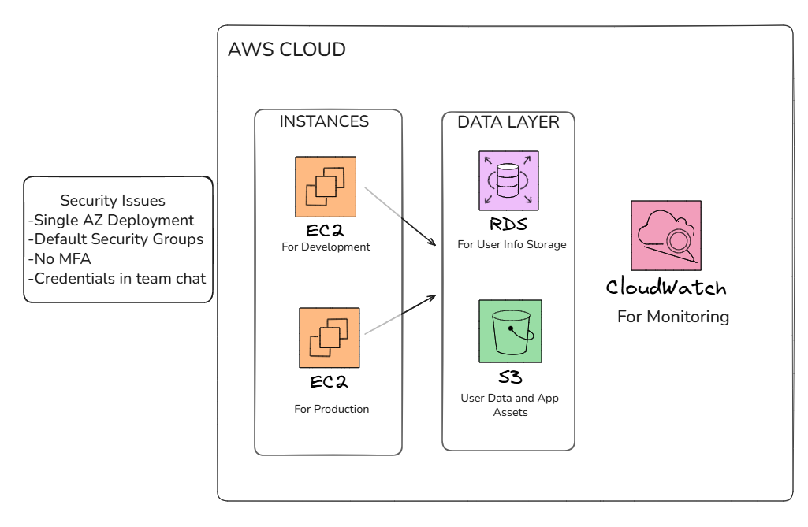
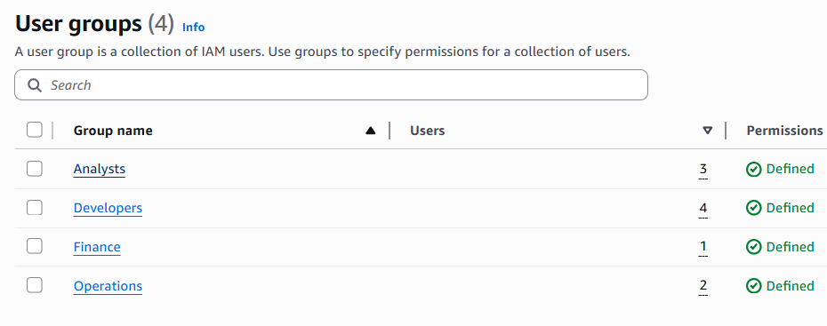
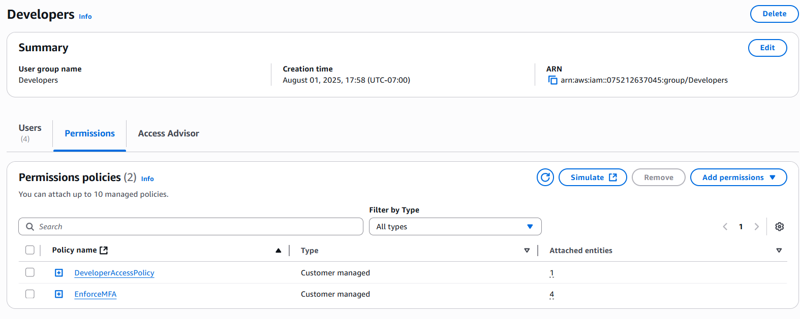
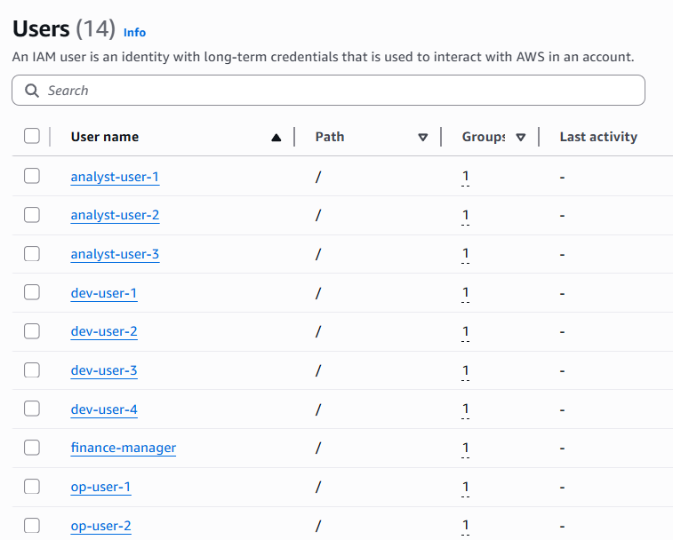

#Repo Description
Securing AWS access for StartupCo using Terraform. IAM users, groups, MFA, and policies based on least-privilege principles.

# IAM Security Project 🔐

A Terraform-based AWS IAM security implementation that transforms a vulnerable cloud environment into a secure, role-based access control system following the principle of least privilege.

## 📋 Table of Contents
- [Project Overview](#project-overview)
- [Security Problems Addressed](#security-problems-addressed)
- [Implementation Details](#implementation-details)
- [Terraform Infrastructure](#terraform-infrastructure)
- [Deployment Guide](#deployment-guide)
- [Security Improvements Achieved](#security-improvements-achieved)

## 🎯 Project Overview

This project demonstrates how to implement enterprise-grade AWS IAM security using Infrastructure as Code (IaC) principles. Starting from a vulnerable environment with shared credentials and overprivileged access, I built a secure, scalable IAM foundation for a fictional startup.

### Key Objectives
- ✅ Eliminate shared credentials and implement individual user accounts
- ✅ Enforce strong password policies across all IAM users
- ✅ Implement role-based access control (RBAC) with least privilege
- ✅ Create scalable group-based permission management
- ✅ Manage all IAM resources as code for consistency and auditability

## 🚨 Security Problems Addressed

The original AWS environment suffered from critical security vulnerabilities:



**Critical Security Flaws:**
- **No Multi-Factor Authentication (MFA)** - Single point of failure for account access
- **Shared Credentials in Team Chat** - Credentials exposed in plaintext communications
- **Default Security Groups** - Overly permissive network access rules
- **Single Availability Zone Deployment** - Poor disaster recovery posture
- **Flat Permission Structure** - All users had identical, excessive permissions

## 🛠️ Implementation Details

### 1. Infrastructure as Code Foundation

My Terraform configuration establishes the foundation for secure IAM management:


**Key Configuration Elements:**
- **Terraform Version Lock:** `>= 1.6.0` ensures consistent behavior
- **AWS Provider:** `~> 5.0` for latest security features
- **Version Constraints:** Prevents breaking changes in production

### 2. Strong Password Policy Implementation

We implemented a comprehensive password policy that exceeds industry standards:


**Password Requirements:**
- **Minimum Length:** 12 characters
- **Complexity Requirements:**
  - At least one uppercase letter (A-Z)
  - At least one lowercase letter (a-z)
  - At least one number (0-9)
  - At least one special character
- **Security Controls:**
  - 90-day password expiration
  - Self-service password changes enabled
  - Prevents reuse of last 5 passwords

### 3. Role-Based Access Control (RBAC)

Created four distinct IAM groups with carefully scoped permissions:



#### Group Breakdown:
- **👩‍💻 Developers (4 users):** Full EC2 + S3 access, read-only CloudWatch monitoring
- **🔧 Operations (2 users):** Full infrastructure access (EC2, RDS, SSM, CloudWatch)
- **💰 Finance (1 user):** Budget management + Cost Explorer + billing read-only
- **📊 Analysts (3 users):** Read-only access to data sources and reporting tools

#### Example: Developer Group Policy Implementation

The Developers group demonstrates our layered security approach with both functional access and security enforcement:



**Attached Policies:**
- **`DeveloperAccessPolicy`** - Custom policy providing core development permissions
- **`EnforceMFA`** - Security policy requiring multi-factor authentication for all actions

**Policy Implementation Benefits:**
- **Separation of Concerns:** Functional permissions separated from security requirements
- **Scalable Security:** MFA enforcement applied consistently across all groups
- **Custom Access Control:** Tailored permissions that match developer workflow needs
- **AWS Console Integration:** Policies visible and manageable through AWS IAM interface

**Developer-Specific Permissions Include:**
- **Full EC2 Access:** Create, modify, and terminate development instances
- **Complete S3 Access:** Deploy applications and manage development assets  
- **Read-Only CloudWatch:** Monitor application performance and logs
- **Restricted Database Access:** No direct RDS access to protect production dataRetryClaude does not have the ability to run the code it generates yet.Claude can make mistakes. Please double-check responses.

### 4. Individual User Account Management

Eliminated shared credentials by creating individual accounts for all team members:



**User Management Features:**
- **10 Individual Accounts:** Each team member has a unique identity
- **Group-Based Assignment:** Users inherit permissions through group membership
- **Scalable Structure:** Easy to add/remove users and modify permissions
- **Audit Trail:** All actions traceable to specific individuals


## 🏗️ Terraform Infrastructure

### Project Structure
```
iam-security-project/
├── main.tf           # Core IAM resources (users, groups, policies)
├── variables.tf      # Input variables and configuration
├── outputs.tf        # Resource outputs and references  
├── versions.tf       # Terraform and provider version constraints
├── .gitignore       # Excludes sensitive files and Terraform state
└── README.md        # Project documentation
```

### Core Resources Managed
- **IAM Groups:** Role-based permission containers
- **IAM Users:** Individual team member accounts  
- **IAM Policies:** Custom permission sets following least privilege
- **Account Password Policy:** Organization-wide security requirements


## 🎉 Security Improvements Achieved

### Before vs. After Comparison

| Security Aspect | Before | After |
|----------------|--------|-------|
| **Authentication** | Shared credentials | Individual accounts + strong passwords |
| **Authorization** | Flat, excessive permissions | Role-based, least privilege access |
| **Accountability** | No audit trail | Individual user tracking |
| **Password Security** | No policy enforcement | Comprehensive password requirements |
| **Infrastructure Management** | Manual, inconsistent | Automated, version-controlled |

### Measurable Improvements
- **🔐 100% elimination** of shared credentials
- **📈 90-day** password rotation policy
- **👥 4 distinct** permission levels based on job function  
- **📊 14 individual** user accounts for complete audit trails
- **🔄 Infrastructure as Code** for consistent, repeatable deployments

### Compliance Benefits
- **SOC 2 Type II:** Enhanced access controls and audit trails
- **PCI DSS:** Strong authentication and authorization controls
- **ISO 27001:** Documented security procedures and least privilege access
- **AWS Well-Architected:** Security pillar best practices implementation

## 🔮 Future Enhancements

- **Multi-Factor Authentication (MFA):** Require MFA for all user accounts
- **Cross-Account Roles:** Implement assume-role patterns for multi-account access
- **Policy Validation:** Automated testing of IAM policies using IAM Access Analyzer
- **Secrets Management:** Integration with AWS Secrets Manager for credential rotation
- **Monitoring & Alerting:** CloudWatch alarms for suspicious IAM activities


## 🚀 Deployment Guide

### Prerequisites
- AWS CLI configured with appropriate credentials
- Terraform `>= 1.6.0` installed
- Git for version control

### Deployment Steps

1. **Clone and Initialize**
   ```bash
   git clone <repository-url>
   cd iam-security-project
   terraform init
   ```

2. **Review and Plan**
   ```bash
   terraform plan
   # Review the planned changes carefully
   ```

3. **Apply Configuration**
   ```bash
   terraform apply
   # Type 'yes' when prompted to confirm
   ```

4. **Verify Deployment**
   ```bash
   # Check created resources in AWS Console
   # Verify users can access appropriate resources
   # Test password policy enforcement
   ```

### Post-Deployment Actions
- [ ] Distribute individual credentials securely to team members
- [ ] Enforce MFA setup for all users
- [ ] Set up CloudTrail for comprehensive audit logging
- [ ] Create automated compliance monitoring

## 📚 References

- [AWS IAM Best Practices](https://docs.aws.amazon.com/IAM/latest/UserGuide/best-practices.html)
- [Terraform AWS Provider Documentation](https://registry.terraform.io/providers/hashicorp/aws/latest/docs)
- [AWS Well-Architected Security Pillar](https://docs.aws.amazon.com/wellarchitected/latest/security-pillar/welcome.html)

---

**Project Author:** Yousif Alani 
**Last Updated:** July 28, 2025 